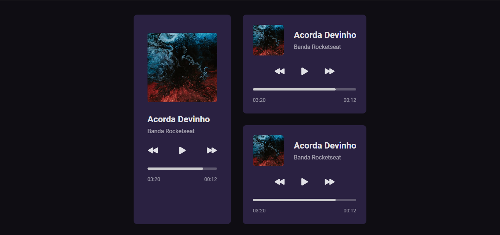

# Projeto Player de Musica da Rocketseat

## Descrição do Projeto
Exercício da plataforma Rocketseat com intuito de testar conhecimento. Criação de um player de musica com basíco de HTML e CSS.

## Status do Projeto
Concluido mas será modificado

## Acesso ao Projeto
Forneça um link para o repositório do seu projeto no GitHub.

## Tecnologias Utilizadas
Utilizado básico de HTML e CSS.

## Licença
MIT
